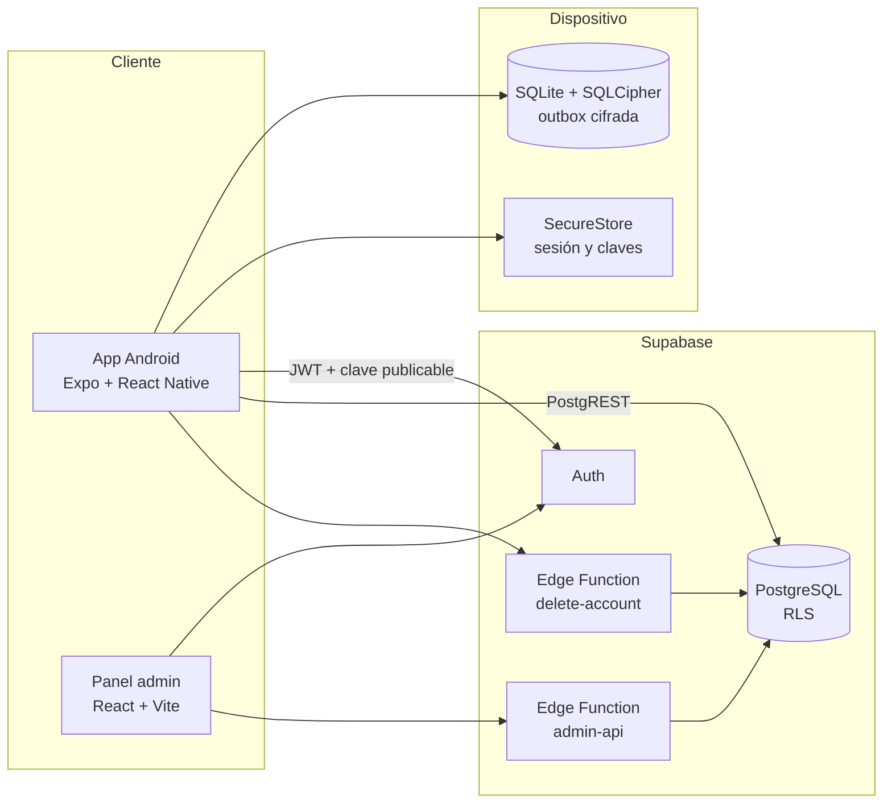

<div align="center">

# DuocMind

**Organización académica y bienestar emocional para estudiantes de Duoc UC**

Proyecto Capstone · APT122 · Duoc UC


</div>

---

## Tabla de contenidos

- [Descripción](#descripción)
- [Funcionalidades](#funcionalidades)
- [Stack tecnológico](#stack-tecnológico)
- [Arquitectura](#arquitectura)
- [Estructura del repositorio](#estructura-del-repositorio)
- [Requisitos previos](#requisitos-previos)
- [Puesta en marcha](#puesta-en-marcha)
- [Scripts disponibles](#scripts-disponibles)
- [Pruebas y CI](#pruebas-y-ci)
- [Seguridad y privacidad](#seguridad-y-privacidad)
- [Metodología de trabajo](#metodología-de-trabajo)
- [Convenciones de Git](#convenciones-de-git)
- [Documentación adicional](#documentación-adicional)
- [Equipo](#equipo)

## Descripción

DuocMind es una aplicación móvil Android que ayuda a estudiantes de Duoc UC a organizar su vida académica y a reflexionar sobre su estado emocional. Combina una agenda de pruebas y tareas con un check-in emocional diario, un test de estrés percibido y recursos locales de bienestar.

El proyecto incluye además un **panel web de administración** para el equipo de Bienestar y Salud. El panel gestiona alumnos, cuestionarios, eventos y consejos.

> **Enfoque no clínico.** DuocMind apoya la organización y la reflexión emocional. No diagnostica, no reemplaza la atención profesional y no contacta a terceros de forma automática. La persona siempre conserva el control de la emoción que registra.

## Funcionalidades

### Aplicación móvil (`DuocMind/`)

| Módulo | Descripción |
| --- | --- |
| **Autenticación** | Registro, inicio de sesión y perfil de estudiante con Supabase Auth. Sesión guardada en almacenamiento seguro. |
| **Dashboard** | Resumen semanal del ánimo, notificaciones y accesos rápidos. |
| **Check-in emocional** | Registro diario del ánimo general mediante una escala deslizable, con historial personal. |
| **Test de estrés (PSS-10)** | Cuestionario de estrés percibido con niveles de resultado y restricción de frecuencia. |
| **Agenda** | Registro de pruebas, tareas y actividades académicas, con almacenamiento local. |
| **Bienestar** | Recursos de bienestar incluidos en la app y recursos de crisis disponibles sin conexión. |
| **Modo offline** | Los check-ins se guardan en una base SQLite cifrada con SQLCipher y se sincronizan cuando vuelve la conexión. |
| **Eliminación de cuenta** | Borrado de datos locales y remotos mediante una Edge Function dedicada. |

### Panel de administración (`admin-web/`)

| Módulo | Descripción |
| --- | --- |
| **Dashboard** | Totales del registro, catálogo de sedes y carreras, y últimos accesos. |
| **Alumnos** | Consulta de alumnos y recuperación de contraseña. |
| **Tests** | Editor de cuestionarios propios en cuatro pasos, con versiones, publicación y activación. Protección de instrumentos validados. |
| **Eventos** | Gestión de eventos académicos e institucionales. |
| **Tips** | Consejos generales o condicionados por ánimo y resultado de test. |

## Stack tecnológico

### Aplicación móvil

| Categoría | Tecnología |
| --- | --- |
| Framework | [Expo](https://expo.dev) SDK 57 (flujo administrado) |
| UI | React 19 · React Native 0.86 · React Native Web (previsualización) |
| Navegación | Expo Router 57 con rutas tipadas |
| Lenguaje | TypeScript 5.9 en modo estricto |
| Backend | Supabase JS 2 (Auth + PostgREST) |
| Persistencia local | `expo-sqlite` con SQLCipher · `expo-secure-store` |
| Red | `@react-native-community/netinfo` |
| Gráficos | `react-native-svg` |
| Tipografía | Inter y Nunito (`@expo-google-fonts`) |

### Panel de administración

| Categoría | Tecnología |
| --- | --- |
| Framework | React 19 + [Vite](https://vite.dev) 8 |
| Navegación | React Router 7 |
| Lenguaje | TypeScript 5.9 en modo estricto |
| Backend | Supabase JS 2 + Edge Function `admin-api` |
| Pruebas E2E | Playwright 1.63 |

### Backend e infraestructura

| Categoría | Tecnología |
| --- | --- |
| Base de datos | PostgreSQL (Supabase) con Row Level Security |
| Autenticación | Supabase Auth (email y contraseña) |
| Funciones serverless | Supabase Edge Functions sobre Deno 2 (`admin-api`, `delete-account`) |
| Migraciones | Supabase CLI 2 (`supabase/migrations/`) |
| Entorno de desarrollo | Docker y Docker Compose |
| CI | GitHub Actions |
| Runtime | Node.js 24 · npm 11.13 |

## Arquitectura



La app organiza el código **por funcionalidad** y separa cada una en capas con dependencias en un solo sentido:

```
features/<funcionalidad>/
├── domain/          # Tipos y cálculos puros, sin React ni backend
├── application/     # Casos de uso e interfaces de gateways
├── infrastructure/  # Implementaciones de Supabase, SQLite y SecureStore
├── components/      # Componentes propios de la funcionalidad
└── screens/         # Pantallas y estilos
```

Las pantallas nunca llaman a Supabase ni a SQLite directamente. Las variantes por plataforma usan los sufijos `.native.ts` y `.web.ts`.

## Estructura del repositorio

```
capstone/
├── .github/workflows/        # CI: validate.yml (app) y admin.yml (panel + backend)
├── DuocMind/                 # Aplicación móvil y backend Supabase
│   ├── src/
│   │   ├── app/              # Rutas de Expo Router: (auth) y (app)
│   │   ├── features/         # agenda, auth, dashboard, emotional-checkin, home, pending, wellness
│   │   └── shared/           # backend, components, motion, theme
│   ├── supabase/
│   │   ├── migrations/       # Esquema SQL versionado
│   │   ├── functions/        # Edge Functions (admin-api, delete-account)
│   │   └── seed.sql
│   ├── tools/                # Scripts del entorno local y suites de backend
│   ├── tests/                # Pruebas unitarias (node:test)
│   ├── specs/                # Specs, planes y tareas por incremento
│   ├── docs/                 # Constitución y guías
│   ├── Dockerfile
│   └── compose.yaml
├── admin-web/                # Panel de administración
│   ├── src/                  # application, components, domain, infrastructure, pages
│   ├── tests/                # Pruebas unitarias
│   └── e2e/                  # Pruebas Playwright
└── Fase 1/ · Fase 2/ · Fase 3/   # Evidencias académicas del Capstone
```

## Requisitos previos

| Herramienta | Versión | Uso |
| --- | --- | --- |
| Node.js | 24.x (ver `DuocMind/.nvmrc`) | Todos los proyectos |
| npm | 11.13.0 | Gestor de paquetes |
| Docker | Reciente | Supabase local y contenedor de desarrollo |
| Android SDK | Según Expo SDK 57 | Development build nativo |
| Proyecto Supabase | — | URL y clave **publicable** |

## Puesta en marcha

### 1. Clonar el repositorio

```bash
git clone https://github.com/NicolasBeatum/capstone.git
cd capstone
```

### 2. Aplicación móvil

```bash
cd DuocMind
npm ci
cp .env.example .env
```

Completar `.env` con los datos del proyecto Supabase:

```dotenv
EXPO_PUBLIC_SUPABASE_URL=https://<tu-proyecto>.supabase.co
EXPO_PUBLIC_SUPABASE_PUBLISHABLE_KEY=sb_publishable_...
```

La clave está en **Supabase Dashboard → Project Settings → API Keys → Publishable key**.

> **Importante:** usar solo la clave publicable. Nunca usar una clave `secret` o `service_role` en una variable `EXPO_PUBLIC_*`, porque Expo la incluye en la app.

Iniciar la app:

```bash
npm run web               # Previsualización web en http://localhost:8081
npx expo run:android      # Development build nativo (necesario para SQLCipher y offline)
```

Con Docker:

```bash
docker compose up --build # Previsualización en http://localhost:8081
```

La guía completa del backend, las migraciones y la Edge Function está en [docs/configurar-env-supabase.md](DuocMind/docs/configurar-env-supabase.md).

### 3. Panel de administración con backend local

Con Docker en ejecución, desde la raíz del repositorio:

```bash
npm ci --prefix DuocMind/tools
npm ci --prefix admin-web
node DuocMind/tools/scripts/local-start.mjs      # Inicia Supabase local y aplica migraciones
node DuocMind/tools/scripts/fixtures.mjs         # Crea cuentas sintéticas
node DuocMind/tools/scripts/staff.mjs staff enable
```

En una terminal, iniciar la API:

```bash
node DuocMind/tools/scripts/local-serve.mjs
```

En otra terminal, iniciar el panel:

```bash
npm --prefix admin-web run dev                   # http://127.0.0.1:5173
```

Las credenciales de prueba están en `DuocMind/tools/.local/fixtures.json`. Git ignora ese archivo. El buzón de correo local está en `http://127.0.0.1:54324`.

Para detener los servicios locales:

```bash
DuocMind/tools/node_modules/.bin/supabase stop --workdir DuocMind
```

Más detalles en [admin-web/README.md](admin-web/README.md).

## Scripts disponibles

### `DuocMind/`

| Comando | Descripción |
| --- | --- |
| `npm run start` | Inicia el servidor Metro de Expo |
| `npm run web` | Previsualización web en el puerto 8081 |
| `npm run android` | Abre la app en Android con Expo |
| `npm test` | Pruebas unitarias con `node:test` |
| `npm run typecheck` | Comprobación de tipos con `tsc` |

### `admin-web/`

| Comando | Descripción |
| --- | --- |
| `npm run dev` | Servidor de desarrollo Vite contra Supabase local |
| `npm run dev:remote` | Servidor de desarrollo contra el proyecto Supabase remoto |
| `npm run build` | Comprobación de tipos y build de producción |
| `npm test` | Pruebas unitarias |
| `npm run test:e2e` | Pruebas end-to-end con Playwright |
| `npm run typecheck` | Comprobación de tipos |

### `DuocMind/tools/`

| Comando | Descripción |
| --- | --- |
| `npm run local:start` | Inicia Supabase local |
| `npm run local:fixtures` | Genera datos y cuentas sintéticas |
| `npm run local:serve` | Sirve las Edge Functions en local |
| `npm run local:ready` | Comprueba que el backend local está listo |
| `npm run test:backend` | Suites de RLS, seguridad, concurrencia, transacciones y más |

## Pruebas y CI

| Capa | Herramienta | Ubicación |
| --- | --- | --- |
| Unitarias (app) | `node:test` | `DuocMind/tests/` |
| Unitarias (panel) | `node:test` | `admin-web/tests/` |
| End-to-end (panel) | Playwright | `admin-web/e2e/` |
| Backend (RLS, seguridad, API) | Node + Postgres local | `DuocMind/tools/tests/` |
| Edge Functions | `deno check` · `deno test` | `DuocMind/supabase/functions/` |
| Esquema | `supabase db advisors` | Base local |

GitHub Actions ejecuta dos workflows en cada push y pull request hacia `dev` y `main`:

- **Validar DuocMind** ([validate.yml](.github/workflows/validate.yml)): `typecheck` y pruebas unitarias de la app.
- **Validar administración local** ([admin.yml](.github/workflows/admin.yml)): levanta Supabase local y ejecuta pruebas de backend, Deno, advisors, unitarias, build y E2E del panel.

Los workflows de CI usan solo datos sintéticos. No acceden a datos reales ni modifican el proyecto Supabase remoto.

## Seguridad y privacidad

DuocMind trata los datos emocionales como **datos sensibles**:

- **Row Level Security** en todas las tablas de usuario. Cada estudiante solo puede leer y modificar sus propios datos, y hay pruebas automatizadas de aislamiento.
- **Cifrado local** con SQLCipher. Cada cuenta tiene su propia clave, guardada en SecureStore.
- **Sin secretos en el cliente.** Solo se usan claves publicables en `EXPO_PUBLIC_*` y `VITE_*`. Las claves privilegiadas existen únicamente en las Edge Functions.
- **Logs sin datos sensibles.** Logs, errores y pruebas no registran respuestas emocionales, sesiones ni credenciales.
- **Datos sintéticos** en desarrollo y CI.
- **Derecho a eliminación.** El estudiante puede borrar su cuenta con todos sus registros emocionales.

## Metodología de trabajo

El proyecto usa **Spec-Driven Development**. Cada incremento vive en `DuocMind/specs/<incremento>/` y sigue este orden:

```
spec.md  →  plan.md  →  tasks.md  →  implementación
```

| Incremento | Contenido |
| --- | --- |
| [001-project-foundation](DuocMind/specs/001-project-foundation/spec.md) | Base del proyecto Expo |
| [002-supabase-connection](DuocMind/specs/002-supabase-connection/spec.md) | Conexión con Supabase |
| [003-emotional-checkin](DuocMind/specs/003-emotional-checkin/spec.md) | Check-in emocional e instrumentos |
| [004-emotional-checkin-history](DuocMind/specs/004-emotional-checkin-history/spec.md) | Historial personal de check-ins |
| [005-admin-dashboard](DuocMind/specs/005-admin-dashboard/spec.md) | Panel de administración |

Las reglas generales están en la [constitución del proyecto](DuocMind/docs/constitution.md). La constitución prevalece sobre las specs, las specs sobre los planes y los planes sobre las tareas.

## Convenciones de Git

- **Ramas:** `main` contiene entregas estables y `dev` integra los cambios. Las ramas de trabajo parten de `dev` y usan los prefijos `feature/*`, `fix/*`, `docs/*` y `chore/*`.
- **Pull requests:** los cambios llegan a `dev` y después a `main`. `main` requiere CI verde y al menos una aprobación.
- **Commits:** formato `tipo: descripción en español`, con los tipos `feat`, `fix`, `docs`, `refactor`, `test`, `build`, `ci`, `chore` y `revert`.

```bash
git commit -m "feat: agrega historial semanal del check-in"
```

## Documentación adicional

| Documento | Contenido |
| --- | --- |
| [DuocMind/README.md](DuocMind/README.md) | Ejecución detallada de la app móvil |
| [admin-web/README.md](admin-web/README.md) | Ejecución y uso del panel de administración |
| [DuocMind/AGENTS.md](DuocMind/AGENTS.md) | Guía de trabajo, arquitectura y diseño |
| [DuocMind/docs/constitution.md](DuocMind/docs/constitution.md) | Principios y reglas del proyecto |
| [DuocMind/docs/configurar-env-supabase.md](DuocMind/docs/configurar-env-supabase.md) | Configuración de Supabase, migraciones y Android cifrado |
| [DuocMind/supabase/ENDPOINTS.md](DuocMind/supabase/ENDPOINTS.md) | Contrato de la API de datos |

## Equipo

| Integrante | GitHub |
| --- | --- |
| Nicolás Hernández | [@NicolasBeatum](https://github.com/NicolasBeatum) |
| Hans Mancilla | [@HansIgnaci0](https://github.com/HansIgnaci0) |
| Gustavo Roldán | [@gusroldan](https://github.com/gusroldan) |

---

<div align="center">

Proyecto académico desarrollado para la asignatura **Capstone (APT122)** de Duoc UC.

</div>
